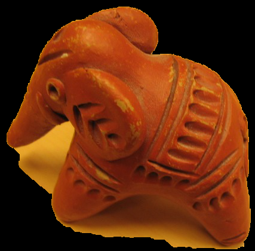
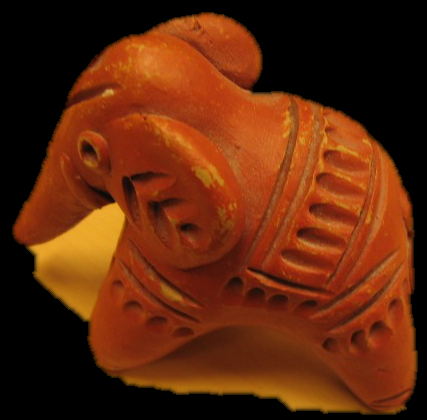

# GrabCut Segmentation and Border Matting Algorithms
**GrabCut Segmentation Algorithm:**

The GrabCut Segmentation algorithm implemented in the Python script performs foreground and background segmentation for an input image. The main steps of the algorithm are as follows:

1. Initialization: The algorithm initializes the image, mask, and a rectangle representing the bounding box of the foreground object. Various parameters for foreground and background labeling are also initialized.

2. GMM Component Assignment: The algorithm assigns Gaussian Mixture Model (GMM) components for the foreground and background regions of the image. It estimates the GMM parameters (mean, covariance, and mixing coefficients) for each region using the Expectation-Maximization (EM) algorithm.

3. Estimation of α_n: The algorithm estimates the alpha values (α_n) for each pixel with the EM algorithm. The alpha values represent the probability of a pixel being either fully background (0) or fully foreground (1).

4. Edge and Weight Calculation: The algorithm calculates the edges and weights of each vertex in the graph to estimate the minimum cut segmentation. The edge weights are calculated based on color similarity and smoothness constraints using the calculated GMMs.

5. Energy Function Iteration: The algorithm iteratively calculates the energy function, which measures the consistency of the estimated segmentation with the observed data. The iteration continues from step 2 to step 5 until convergence.

6. Mask Estimation: The algorithm estimates the final mask for foreground and background regions using the minimum cut obtained from the GraphCut optimization process.

**Border Matting Algorithm:**
The Border Matting algorithm in the Python script aims to improve the quality of the alpha matte (representing the opacity of each pixel) obtained from the GrabCut segmentation. The main steps of the algorithm are as follows:

1. Contour Finding: The algorithm uses an erosion and Canny edge detection algorithm to find the contour on the given trimap. The contour represents the border pixels between the foreground (T_F) and background (T_B) regions.

2. Pixel Grouping: For each pixel in the trimap, the algorithm finds the nearest contour pixel. It groups the pixels and maps them to the corresponding contour pixels.

3. Minimizing Energy Function: The algorithm minimizes the energy function using dynamic programming to find the best delta and sigma pairs for smoothing regularizer traversal at each pixel on the contour.

4. Alpha Map Construction: The algorithm constructs the alpha map using a [0, 1] partition for pixels inside the contour. It multiplies this alpha map with the foreground image to obtain the final Border Matting result.

After segmentation and border matting:

   

## Project Installation
To install the Grabcut project, complete the following steps:

Clone this repository:
 ```
git clone with https://github.com/RexRusk/GrabCut.git
 ```

Install the necessary requirements from requirements.txt

**To Run**

Run 'GrabCut.py'

**References**

[1] Rother, Carsten, Vladimir Kolmogorov, and Andrew Blake. "GrabCut: Interactive foreground extraction using iterated graph cuts." ACM transactions on graphics (TOG) 23.3 (2004): 309-314.

[2] Boykov, Yuri Y., and M-P. Jolly. "Interactive graph cuts for optimal boundary & region segmentation of objects in ND images." Proceedings eighth IEEE international conference on computer vision. ICCV 2001. Vol. 1. IEEE, 2001.

